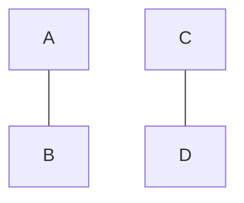

+++
date = "2024-11-02"
title = "Second Post Title"
summary = "Post Summary"
description = "Post Description"
toc = false
autonumber = true
readTime = true
math = true
tags = ["database", "java"]
showTags = false
hideBackToTop = false
hidePagination = true
fediverse = "@ole@fosstodon.org"
draft = false
+++

# h1
## h2
### h3
#### h4
##### h5

$a=b$

```python
print("hello world")
```


